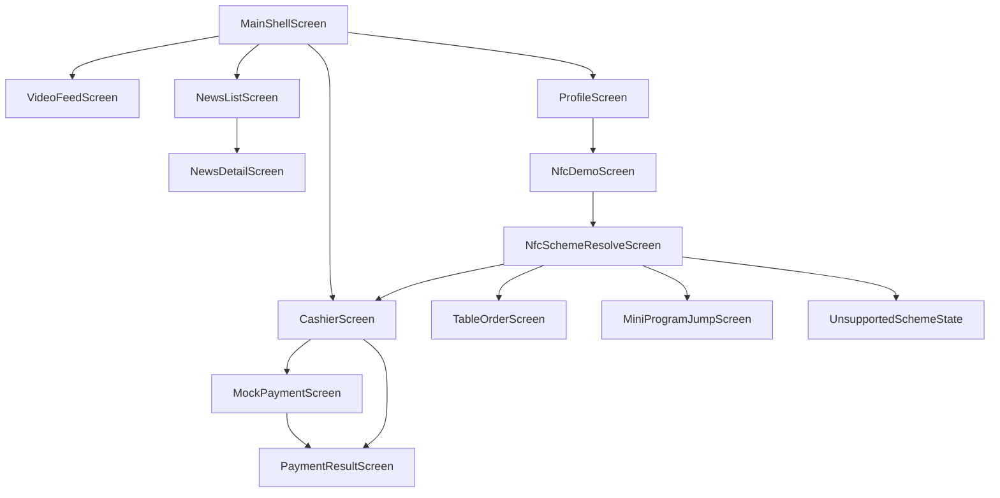

# FlowCast Demo Screen Map

说明：此图描述产品目标页面关系。当前 Android Compose 实现中，`NfcSchemeResolveScreen` 的职责由 `NfcResultScreen` 承载；`TableOrderScreen` 和 `MiniProgramJumpScreen` 已作为 NFC 后续动作的轻量模拟页实现。

## Android Screens

- `MainActivity`: Compose entry point and navigation host.
- `MainShellScreen`: product-level name for the `Scaffold` + `NavHost` structure in `FlowCastApp`.
- `VideoFeedScreen`: visual-first video feed prototype.
- `NewsListScreen`: AI news list.
- `NewsDetailScreen`: AI summary and source link.
- `CashierScreen`: order and payment method selection.
- `MockPaymentScreen`: simulated third-party payment page.
- `PaymentResultScreen`: success, failed, or canceled result.
- `NfcDemoScreen`: manual trigger for NFC scenarios.
- `NfcSchemeResolveScreen`: target product name for showing the raw Scheme, parsed fields, and next action. Current Android function name is `NfcResultScreen`.
- `UnsupportedSchemeState`: fallback state for malformed or unsupported NFC Schemes.
- `TableOrderScreen`: lightweight placeholder reached from NFC table Schemes, showing recovered store/table context and sample menu information.
- `MiniProgramJumpScreen`: lightweight placeholder reached from NFC mini-program Schemes, showing platform/appId/path jump parameters.
- `ProfileScreen`: demo information and utility entry points.

## Route Notes

- `video`: default tab.
- `news`: news list.
- `news/{newsId}`: news detail.
- `cashier`: demo cashier.
- `mockPay/{methodId}`: mock third-party payment, where `methodId` is `alipay`, `wechat`, or `unionpay`.
- `paymentResult/{status}`: mock result, where `status` is `success`, `failed`, or `canceled`.
- `profile`: demo information and utility entry points.
- `nfc`: NFC scenario list.
- `nfcResult/{scenarioId}`: NFC scheme parsing result, where `scenarioId` is `merchant`, `table`, or `miniapp`.
- `tableOrder`: NFC table-order placeholder.
- `miniProgram`: NFC mini-program jump placeholder.
