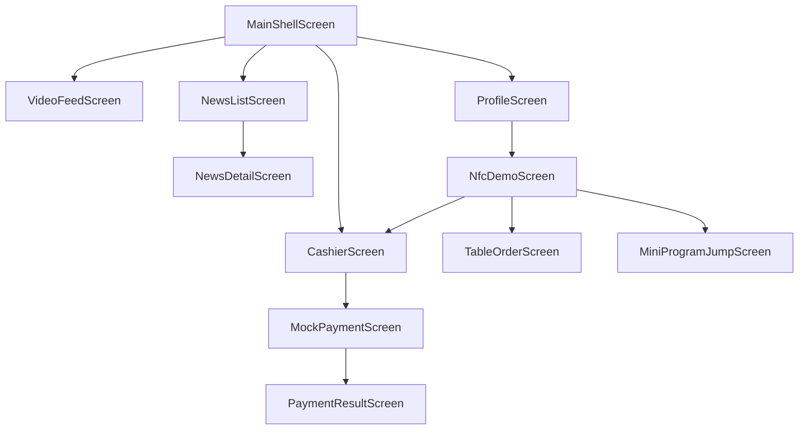

# FlowCast Demo Screen Map

## Android Screens

- `MainActivity`: Compose entry point and navigation host.
- `VideoFeedScreen`: visual-first video feed prototype.
- `NewsListScreen`: AI news list.
- `NewsDetailScreen`: AI summary and source link.
- `CashierScreen`: order and payment method selection.
- `MockPaymentScreen`: simulated third-party payment page.
- `PaymentResultScreen`: success, failed, or canceled result.
- `NfcDemoScreen`: manual trigger for NFC scenarios.
- `ProfileScreen`: demo information and utility entry points.
